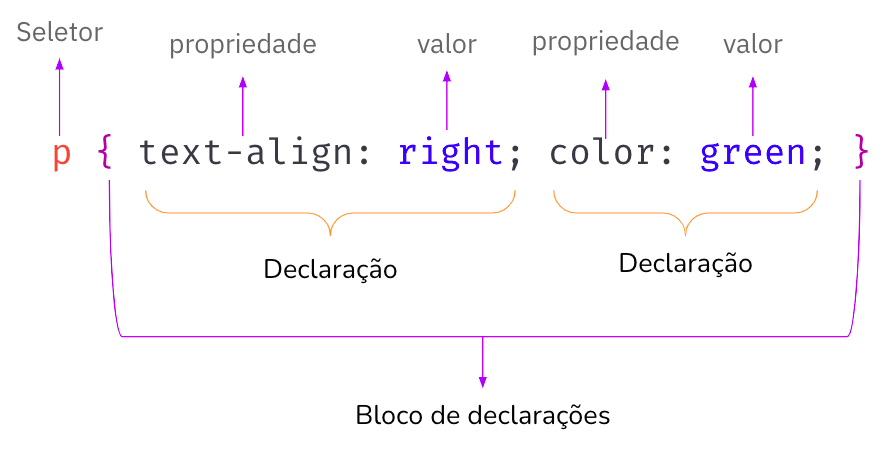
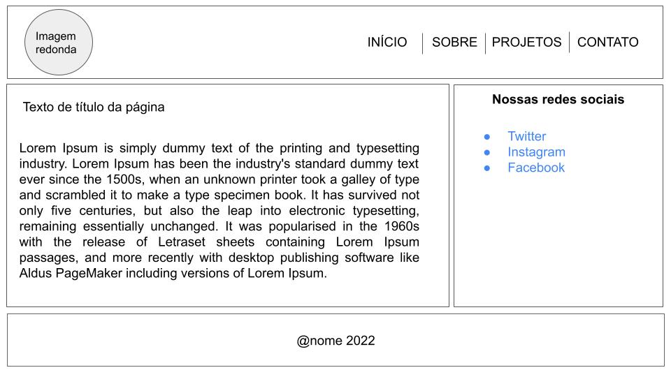

#  CSS - Cascading Style Sheets
Prof. Jesiel Viana 
@jesielviana

---
## Objetivos de aprendizagem
- Compreender o uso de CSS para construção de páginas Web
- Entender a sintaxe da CSS
- Conhecer as principais propriedades do CSS
- Criar uma página web com HTML e CSS

---
## Pra que serve CSS?
- Uma página Web é normalmente um arquivo texto estruturado usando uma linguagem de marcação (HTML)
- A apresentação das páginas web em um formato agradável para o público é de responsabilidade dos navegadores
- CSS é utilizado para estilizar o texto/conteúdo da página web

---
## Sintaxe CSS
- CSS é uma linguagem baseada em regras
- Aplicação das regras do CSS é formada por:
  - seletor; e
  - bloco de declarações
- Dentro de um bloco de declarações pode haver várias declarações, cada declaração é composta por **propriedade** e **valor**.

---

---
## 3 formas de adicionar CSS ao HTML
- Inline
- Interno
- Externo

---
## Seletores
- tag
- class
- id
- pseudo-class

---
## Algumas propriedades
- tudo é um box (caixa)
- largura, altura, margem interna e externa
- posicionamento
- cores

---
## Objetivos de aprendizagem
- Compreender o uso de CSS para construção de páginas Web ✅
- Entender a sintaxe da CSS ✅
- Conhecer as principais propriedades do CSS ✅
- Criar uma página web com HTML e CSS ✅

---
# Hora do aluno

Crie uma página web com HTML e CSS conforme o layout seguinte

---

---
## Saibas mais
- https://webdev.jesielviana.com/frontend/css
- https://developer.mozilla.org/pt-BR/docs/Learn/CSS/First_steps/What_is_CSS
- https://developer.mozilla.org/pt-BR/docs/Web/CSS/Syntax
- https://developer.mozilla.org/pt-BR/docs/Learn/CSS/First_steps/Getting_started

---
## @jesielviana

[jesielviana.com](jesielviana.com)
